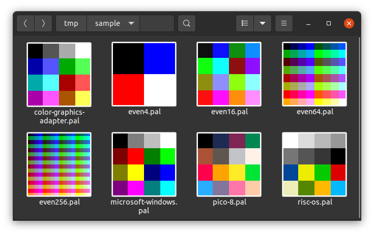

# JASC Palette Thumbnailer

Generates thumbnails for JASC palette files

The install script worked on at least one Ubuntu 20.10 device using GNOME nautilus 3.38.1. There hasn't been any effort to support more than that.

## Building

Build just the binary with `./build.sh build_binary`. This creates an executable at `bin/jasc-pal-thumbnailer`.

Create a `*.deb` package, with the command `./build.sh build_package`. When this package is installed, nautilus should render \*.pal files with thumbnails generated from this program.
